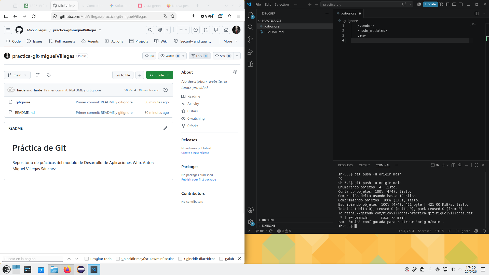
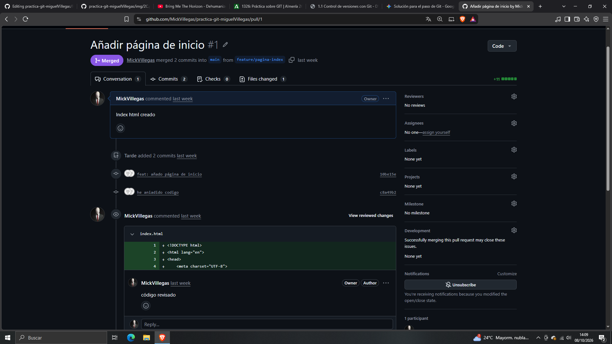
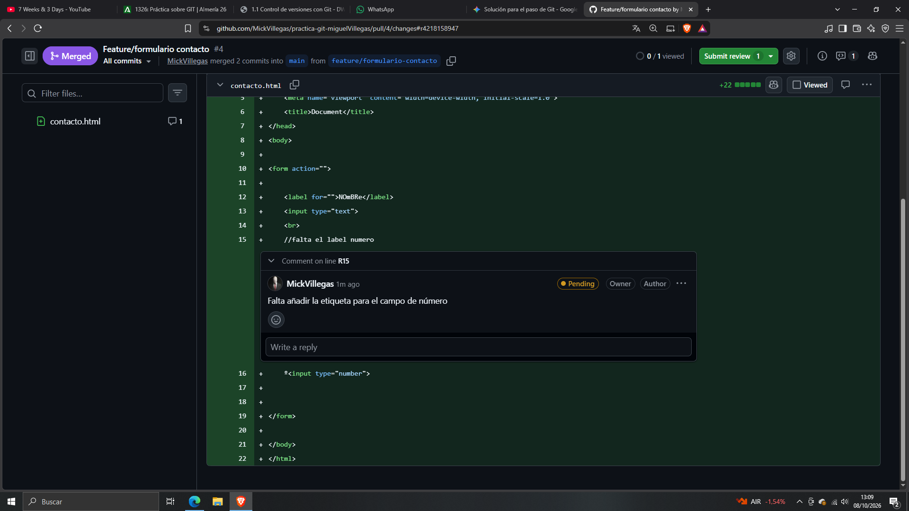
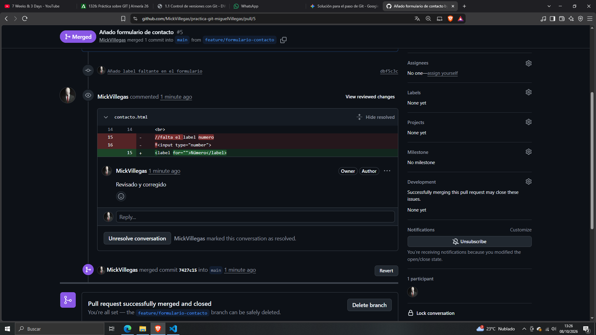
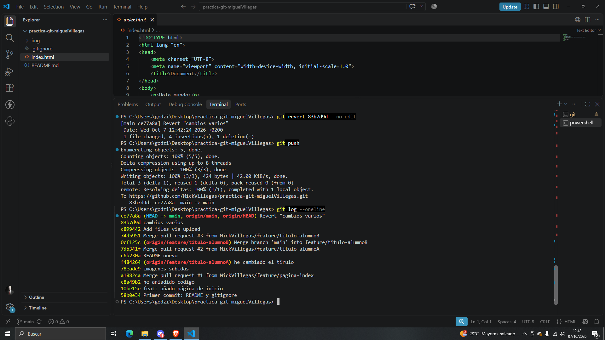

   # Guarana
   # Práctica sobre comandos de GitHubbbb
   Repositorio de prácticas del módulo de Desarrollo de Aplicaciones Web.
   Autor: Miguel Villegas Sánchez

CAPTURA 1: guarda una captura de pantalla del repositorio en GitHub mostrando el commit.

CAPTURA 2: guarda una captura de pantalla del Pull Request ya fusionado (estado Merged).

CAPTURA 3A: guarda una captura de pantalla del archivo con las marcas de conflicto antes de resolverlo.

CAPTURA 3B: guarda una captura de pantalla del archivo con el Pull Request ya fusionado sin conflicto.

CAPTURA 4: guarda una captura de los comentarios de revisión y de la aprobación final.

(AQUÍ TE HE PUESTO DOS)

CAPTURA 5: guarda la captura de git log --oneline donde se vea el commit original y el commit de revert justo debajo.

¿qué hubiera pasado si el Alumno A y el Alumno B hubieran fusionado sus cambios directamente en main con git push, en lugar de usar ramas y Pull Requests?

Si hubieran trabajado en main git habria rechazado el ultimo push (el de alumno dos) poruqe no tendria la rama actualizada  
Si hambos hubieran hecho cambios en una misma linea y el segundo alumno hace un git pull para actualizar se habrian generado conflictos de fusion en su equipo  
Por eso se usan las ramas
